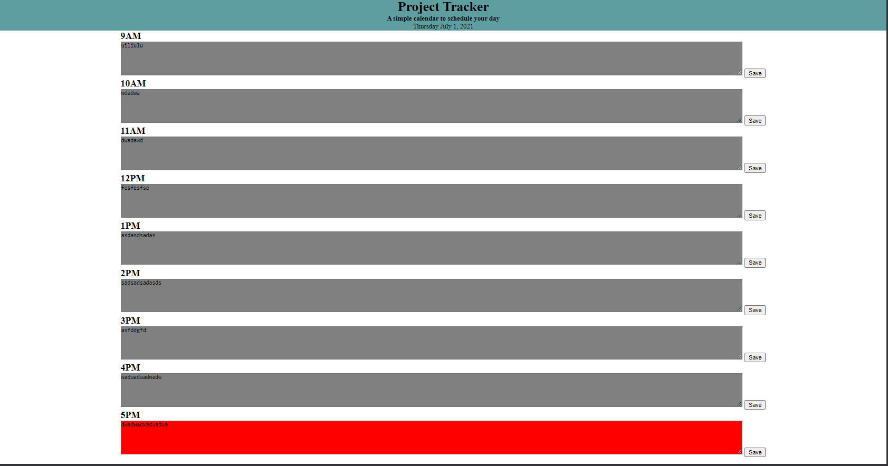

# Work-Day-Scheduler

# HTML, CSS, JS 

**Author**: Charles Glass
**Version**: 1.0.0

## Image

## User Story
AS AN employee with a busy schedule
I WANT to add important events to a daily planner
SO THAT I can manage my time effectively

## Architecture
This application is written in HTML, CSS, and JS
It utilizes the Moment.js library

## Change Log
7-1-2021 2:30pm - Added base code
7-1-2021 5:30pm - Added JS functionality

-->